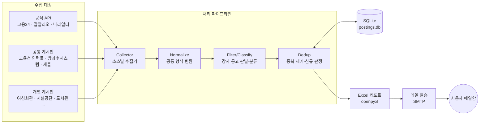

# 울산 공공기관 강사 구인공고 일일 수집·메일 발송 시스템 설계

> 상태: 3단계 구현 완료 (v0.4, 2026-09-27) — 실제 동작·설정 방법은 [README](../README.md), 사전 검증 결과는 [14장](#14-phase-0-사전-검증-결과-2026-09-26), 2단계 결과는 [15장](#15-2단계-결과-2026-09-27), 3단계는 [16장](#16-3단계-결과-2026-09-27)
> 목표: 울산 지역 공공기관(교육청·학교, 지자체, 여성·가족 기관, 공단 체육시설, 국가·공공기관 등)의
> **강사 구인공고를 매일 자동 수집**해서 **엑셀 파일로 정리한 뒤 이메일로 받기**.

---

## 1. 요구사항 정리

| 구분 | 내용 |
|---|---|
| 대상 지역 | 울산광역시 전역 (중구·남구·동구·북구·울주군) |
| 대상 기관 | 울산교육청(본청·교육지원청·방과후·늘봄지원센터·각 학교), 울산시청·구군청, 여성회관·여성인력개발센터·새일센터, 울산시설공단·구군 시설(도시)관리공단(체육시설), 청소년·평생학습·도서관·문화 기관, 울산 소재 국가·공공기관 |
| 대상 공고 | 강사 모집·채용 (방과후/늘봄, 체육·수영·헬스, 평생교육, 문화·예술, 직업훈련 등) |
| 결과물 | 엑셀(.xlsx) 첨부 이메일, 매일 1회 |
| 핵심 품질 | ① 빠짐없이 (커버리지) ② 중복 없이 (어제 본 공고는 "신규"에서 제외) ③ 고장 나면 알 수 있게 (수집 실패 감지) |

### "모든 공고"를 현실적으로 달성하는 전략

울산 공공기관 홈페이지는 수백 개이고, 학교만 해도 250곳이 넘습니다. 전부를 개별로 긁는 방식은
유지보수가 불가능하므로 **"모이는 곳 먼저, 롱테일은 나중에"** 원칙으로 수집합니다.

1. **공식 API (가장 안정적)** – 고용24(워크넷), 잡알리오(공공기관), 나라일터(정부·지자체·교육청)
2. **여러 기관 공고가 모이는 공통 게시판** – 교육청 인력풀, 방과후 온라인지원시스템, 구·군청 새올(eminwon) 채용공고
3. **같은 플랫폼을 쓰는 사이트 묶음** – 인크루트 채용대행 사이트(공단들), 전자정부 표준프레임워크 게시판
4. **개별 기관 게시판** – 여성회관, 시설공단 강습위탁, 도서관, 청소년 기관 등
5. **(선택) 개별 학교 홈페이지** – 비용 대비 효과를 보고 결정

---

## 2. 전체 구조



실행 흐름 (하루 1회):

1. `sources.yaml`에 등록된 소스를 순회하며 목록 페이지(또는 API)에서 최근 공고를 가져온다.
2. 모든 결과를 공통 `Posting` 형식으로 변환한다.
3. 키워드 규칙으로 **강사 구인공고만** 남기고, 분야(방과후/체육/평생교육 등)를 분류한다.
4. DB에 이미 있는 공고는 "기존", 처음 보는 공고는 "신규"로 판정해 저장한다.
5. 엑셀 리포트를 만들고 메일로 보낸다.
6. 소스별 수집 결과(성공/실패/건수)를 기록해 고장 난 수집기를 알린다.

---

## 3. 수집 대상(소스) 설계

상세 목록은 [`config/sources.yaml`](../config/sources.yaml)에 관리합니다. 코드 수정 없이 소스를 추가·비활성화할 수 있게 하는 것이 핵심입니다.

### 3.1 소스 유형(수집기 종류)

| 수집기 | 대상 | 방식 | 비고 |
|---|---|---|---|
| `work24_api` | 고용24(구 워크넷) 채용정보 | Open API (XML) | 근무지역 울산(31xxx) + 키워드 "강사". 인증키 발급 필요 |
| `alio_api` | 잡알리오 공공기관 채용정보 | 공공데이터포털 API | 근무지 울산 필터. 한국폴리텍대학 울산캠퍼스, 울산 혁신도시 기관 등 |
| `gojobs_api` | 나라일터 공공취업정보 | 공공데이터포털 API | 중앙부처·지자체·교육청 공고 통합 |
| `use_cms` | 울산교육청 CMS 게시판 (`use.go.kr/.../BD_selectBbsList.do?q_bbsSn=`) | HTML 파싱 | **같은 CMS라 파서 1개로 게시판 여러 개 처리** |
| `afschool` | 울산방과후학교 온라인지원시스템 | HTML 파싱 | 학교별 방과후 개인위탁 강사모집이 여기 모임 → 학교 홈페이지 개별 수집 부담을 크게 줄여줌 |
| `eminwon` | 구·군청 새올 채용공고 (`OfrNotAncmtLSub.jsp?not_ancmt_se_code=05`) | HTML 파싱 | 전국 공통 시스템이라 파서 1개로 5개 구·군 처리 |
| `incruit` | 공단 채용대행 사이트 (`*.incruit.com`) | HTML 파싱 | 남구도시관리공단, 울주군시설관리공단 등 |
| `generic_board` | 그 밖의 개별 게시판 | CSS 셀렉터 설정 기반 | 셀렉터를 YAML에 적어서 코드 없이 추가 |

### 3.2 1차 수집 대상 (웹 검색으로 확인한 주소)

> ⚠️ 이 설계 작업 환경에서는 네트워크 정책상 해당 사이트에 직접 접속할 수 없어, 주소는 웹 검색 결과로 확인했습니다.
> 구현 첫 단계(Phase 0)에서 실제 접속·파싱 가능 여부를 전수 검증합니다.

| 분류 | 기관/게시판 | 주소 |
|---|---|---|
| 교육청 | 울산교육청 인력풀 – 일반채용공고 | https://use.go.kr/job/user/bbs/BD_selectBbsList.do?q_bbsSn=2249 |
| 교육청 | 방과후·늘봄지원센터 – 채용공고(업체위탁) | https://use.go.kr/after/user/bbs/BD_selectBbsList.do?q_bbsSn=2168 |
| 교육청(학교) | 울산방과후학교 온라인지원시스템 – 강사모집 | https://afschool.use.go.kr/usPrivateApply |
| 지자체 | 울산시청 시험공고 | https://www.ulsan.go.kr/u/rep/transfer/testPblanc/list.ulsan?mId=001004008001000000 |
| 지자체 | 남구청 채용공고(새올) | https://eminwon.ulsannamgu.go.kr/emwp/jsp/ofr/OfrNotAncmtLSub.jsp?not_ancmt_se_code=05 |
| 지자체 | 북구청 채용공고(새올) | https://eminwon.bukgu.ulsan.kr/emwp/jsp/ofr/OfrNotAncmtLSub.jsp?not_ancmt_se_code=05 |
| 지자체 | 남구청 산하기관 채용정보 | https://www.ulsannamgu.go.kr/cop/bbs/selectBoardList.do?bbsId=hireNotice2 |
| 체육시설 | 울산시설공단 채용알림(채용/강습위탁) | https://www.uic.or.kr/notify/noti06.do |
| 체육시설 | 울산시설공단 채용 홈페이지 | https://uic.or.kr/recruit/notify/notify02.do |
| 체육시설 | 울산남구도시관리공단 채용 | https://uncmc.incruit.com/ |
| 체육시설 | 울주군시설관리공단 채용 | https://uljusiseol.incruit.com/ |
| 여성·가족 | 울산광역시 여성회관(중부 새일센터) 공지 | http://www.w1.or.kr/womenhall/ |
| 여성·가족 | 울산여성인력개발센터(울산 새일센터) | https://www.usw.or.kr/ |
| 여성·가족 | 울산가족문화센터 | https://culture.usfcc.or.kr/ |
| 청소년 | 울산광역시 청소년활동진흥센터 | https://www.yesulsan.kr/ |
| 평생교육 | 울산중구도서관 교육강사 | https://lib.junggu.ulsan.kr/lib/contents.do?mId=001005006001000000 |
| 평생교육 | 북구 평생학습관 | https://www.bukgu.ulsan.kr/edu/ |
| 국가·공공 | 고용24 Open API | https://www.work24.go.kr/cm/e/a/0110/selectOpenApiIntro.do |
| 국가·공공 | 잡알리오 공공기관 채용정보 API | https://www.data.go.kr/data/15125273/openapi.do |
| 국가·공공 | 나라일터 공공취업정보 API | https://www.data.go.kr/data/15000485/openapi.do |

**추가 조사 필요 (Phase 2):** 중구·동구·울주군 새올 주소, 중구·동구·북구 시설(도시)관리공단, 동구·북구 여성회관,
울산문화관광재단, 구·군 청소년수련관/청소년문화의집, 울산도서관·구립도서관, 울산 평생교육진흥원, 종합사회복지관 등.

### 3.3 소스 설정 예시

```yaml
- id: use_job_general
  name: 울산교육청 인력풀 일반채용공고
  org_type: 교육청
  district: 울산전체
  collector: use_cms
  url: https://use.go.kr/job/user/bbs/BD_selectBbsList.do?q_bbsSn=2249
  pages: 2            # 목록 몇 페이지까지 볼지
  enabled: true
  keyword_filter: true  # 강사 키워드 필터 적용 (강사 전용 게시판이면 false)
```

`generic_board`는 셀렉터를 함께 적습니다.

```yaml
- id: uic_notice
  collector: generic_board
  url: https://www.uic.or.kr/notify/noti06.do
  selectors:
    row: "table tbody tr"
    title: "td.subject a"
    link: "td.subject a@href"
    date: "td.date"
```

---

## 4. 데이터 모델

### 4.1 `Posting` (공통 공고 형식)

| 필드 | 설명 | 예 |
|---|---|---|
| `uid` | 고유키 = `source_id` + 원문 게시글 번호(없으면 정규화 URL)의 해시 | `a1b2c3...` |
| `source_id` | 수집 소스 | `use_job_general` |
| `org_name` | 공고 기관 | 울산○○초등학교 |
| `org_type` | 기관 유형 | 교육청/학교, 지자체, 공단(체육), 여성·가족, 청소년, 평생교육·도서관, 국가·공공기관 |
| `district` | 지역 | 중구/남구/동구/북구/울주군/울산전체 |
| `title` | 제목 | 2026학년도 방과후학교 외부강사 모집 공고 |
| `url` | 원문 링크 | |
| `posted_date` | 게시일 | 2026-09-25 |
| `deadline` | 접수 마감일 (없으면 공란) | 2026-10-02 |
| `category` | 분야 | 방과후·늘봄 / 체육·수영 / 평생교육·문화 / 직업훈련 / 기타 |
| `status` | 모집중 / 마감 / 결과공고 | |
| `first_seen_at` | 처음 발견 시각 | 신규 판정 기준 |
| `last_seen_at` | 마지막 확인 시각 | |

### 4.2 DB 테이블 (SQLite)

- `postings` : 위 필드 저장, `uid` PRIMARY KEY
- `source_runs` : `run_at`, `source_id`, `ok`, `fetched`, `matched`, `new`, `error` → 수집기 상태 모니터링용

SQLite를 쓰는 이유: 하루 수십 건 규모라 서버형 DB가 필요 없고, 파일 하나라 백업·이동이 쉽습니다.

---

## 5. 강사 공고 판별·분류 규칙

[`config/keywords.yaml`](../config/keywords.yaml)로 분리해 코드 수정 없이 조정합니다.

1. **포함 키워드** (제목 기준, 하나라도 있으면 후보):
   `강사`, `강사모집`, `인력풀`, `지도자`, `코치`, `트레이너`, `강습`, `강습위탁`, `방과후`, `늘봄`, `튜터`, `교관`
2. **제외 키워드** (있으면 제외, 또는 "결과공고"로 표시):
   `수강생`, `강습생`, `회원 모집`, `합격자`, `최종합격`, `결과`, `면접대상`, `서류전형`, `위촉 예정자`, `선정`, `취소`
3. **분야 분류** (제목·본문 키워드 매칭):
   - 방과후·늘봄: 방과후, 늘봄, 돌봄, 초등, 중학교, 고등학교
   - 체육·수영: 수영, 헬스, 요가, 필라테스, 에어로빅, 생활체육, 체육, 스포츠
   - 평생교육·문화: 평생, 도서관, 문화, 예술, 공예, 음악, 미술
   - 직업훈련: 직업, 훈련, 자격증, 새일, 취업
4. **중복 병합**: 같은 공고가 기관 홈페이지와 고용24에 동시에 올라오는 경우,
   `기관명 + 정규화 제목`의 유사도(90% 이상)로 묶고 링크를 모두 보존합니다.
5. **마감일 추출**: 목록에 마감일이 없으면 상세 페이지 본문에서 정규식으로 추출
   (`접수기간 … ~ 2026. 10. 2.(금)`, `10.2.(금)까지` 등). 추출 실패 시 공란 + "원문 확인" 표시.

---

## 6. 엑셀 리포트 설계

파일명: `울산_강사구인_2026-09-27.xlsx`

| 시트 | 내용 |
|---|---|
| **① 신규** | 어제 이후 새로 발견된 공고 (가장 중요) |
| **② 마감임박** | 모집중 공고 중 마감 D-3 이내 |
| **③ 진행중 전체** | 마감일이 지나지 않은 공고 전체 (마감일 불명은 게시 30일 이내) |
| **④ 수집현황** | 소스별 성공/실패, 수집 건수, 오류 메시지 |

①~③ 공통 컬럼:

| No | 분야 | 기관유형 | 기관명 | 지역 | 제목(원문 하이퍼링크) | 게시일 | 마감일 | D-day | 출처 |
|---|---|---|---|---|---|---|---|---|---|

서식: 머리글 고정(틀 고정), 자동 필터, 열 너비 자동, 제목 셀 클릭 시 원문 이동,
D-day 조건부 서식(D-1 이하 빨강, D-3 이하 주황).

---

## 7. 이메일 설계

- **제목**: `[울산 강사구인] 9/27(일) 신규 12건 · 마감임박 5건`
- **본문(HTML)**: 신규 공고 상위 20건 표(분야·기관·제목 링크·마감일) + 수집 실패 소스 경고
- **첨부**: 위 엑셀 파일
- **신규 0건인 날에도 발송** (시스템이 살아있다는 확인용, 설정으로 끌 수 있음)
- **발송 방식**: Gmail SMTP + 앱 비밀번호 (2단계 인증 필요). 계정·비밀번호는 코드에 넣지 않고 환경변수/Secrets로 관리

---

## 8. 실행 환경·스케줄

### 8.1 선택지

| 방식 | 비용 | 장점 | 단점 |
|---|---|---|---|
| **A. GitHub Actions (cron)** | 무료 | 서버 불필요, 설정 간단, 실행 로그 자동 보관 | 실행 서버가 해외 → **일부 국내 공공기관 사이트가 해외 IP를 차단할 수 있음** |
| B. GitHub Actions + 집 PC/NAS를 self-hosted runner로 | 무료(전기료) | 국내 IP라 차단 문제 없음, 관리는 A와 동일 | PC/NAS가 켜져 있어야 함 |
| C. 국내 클라우드 VM + cron | 월 5천~1만원 | 국내 IP, 항상 켜짐 | 서버 관리 필요 |

**권장: A로 시작 → Phase 0에서 해외 IP 차단 소스가 확인되면 B로 전환.**
코드는 어디서나 `python -m ulsan_jobs run` 한 줄로 돌도록 만들어 실행 환경을 바꿔도 코드 수정이 없게 합니다.

### 8.2 스케줄

- 매일 **오전 7시(KST)** = cron `0 22 * * *` (UTC)
- GitHub Actions 예약 실행은 수~수십 분 지연될 수 있음 (메일은 7시대 도착 예상)

### 8.3 상태(DB) 보관 (GitHub Actions 사용 시)

Actions는 매번 새 서버에서 돌기 때문에 "어제까지 본 공고" 기록을 따로 보관해야 합니다.

- 권장: 별도 `state` 브랜치에 `postings.db`를 커밋 (단일 커밋으로 덮어써서 저장소 비대화 방지)
- 부수 효과: 매일 커밋이 생겨, 공개 저장소에 적용되는 "60일간 저장소 활동이 없으면 예약 실행 자동 중지" 정책도 회피

### 8.4 비밀값 (GitHub Secrets)

| 이름 | 용도 |
|---|---|
| `SMTP_USER`, `SMTP_APP_PASSWORD` | 메일 발송 계정 |
| `MAIL_TO` | 수신 주소 (여러 명이면 쉼표 구분) |
| `WORK24_API_KEY` | 고용24 Open API 인증키 |
| `DATA_GO_KR_KEY` | 공공데이터포털 인증키 (잡알리오·나라일터) |

---

## 9. 안정성·운영

- **소스 격리**: 한 사이트가 실패해도 나머지는 계속 수집하고 메일은 발송
- **재시도**: 네트워크 오류 시 지수 백오프로 최대 3회. 연결 단계 실패는 10초씩 2회까지만 기다리고,
  한 번 접속하지 못한 서버는 같은 실행 안에서 다시 기다리지 않음 (같은 서버의 다른 게시판은 바로 실패 처리)
- **시간 제한**: 수집이 20분을 넘으면 남은 소스와 끝의 재시도를 건너뛰고 메일부터 보냄 (Actions 작업 제한 30분)
- **다른 서버에서 보충 수집**: 접속불가·시간초과 소스는 워크플로의 `catch-up` 작업이 새 러너(다른 지역일 수 있음)에서
  그 소스만 다시 수집하고, 새 공고가 있을 때만 보충 메일을 보냄
- **실패 표시**: 메일에는 '확인이 필요한 사이트'(오류·0건·시간초과, 빨강)와 '접속 안 된 사이트'(접속불가, 회색 한 줄)를 나눠
  쉬운 말로 보여 주고, 자세한 오류는 실행 로그에만 남김
- **예의 있는 수집**: 같은 사이트 요청 간 1~2초 간격, 목록 1~2페이지만, robots.txt 준수, User-Agent에 연락처 표기
- **고장 감지**: ① 파싱 오류 ② 평소 공고가 있던 소스가 N일 연속 0건 → 메일 상단과 ④수집현황 시트에 경고
  (사이트 개편으로 파서가 깨지는 것이 가장 흔한 장애)
- **테스트**: 소스별 HTML 샘플을 `tests/fixtures/`에 저장해 파서 회귀 테스트
- **CLI 도구**: `run`(전체 실행), `check-source <id>`(소스 하나만 시험), `send-test-mail`(메일 설정 확인)

---

## 10. 기술 스택

| 영역 | 선택 | 이유 |
|---|---|---|
| 언어 | Python 3.12 | 크롤링·엑셀 라이브러리 생태계 |
| HTTP | `httpx` | 타임아웃·재시도·HTTP/2 |
| HTML 파싱 | `selectolax` 또는 `BeautifulSoup4` | 빠름 / 관대함 |
| 동적 페이지 | `playwright` (필요한 소스에만) | JS 렌더링 사이트 대비 |
| 설정 | `PyYAML` + `pydantic` | 설정 오류 조기 발견 |
| 엑셀 | `openpyxl` | 서식·하이퍼링크·조건부 서식 |
| 중복 판정 | `rapidfuzz` | 제목 유사도 |
| DB | `sqlite3` (표준 라이브러리) | 추가 설치 없음 |
| 메일 | `smtplib` (표준 라이브러리) | |

---

## 11. 프로젝트 구조 (예정)

```
ulsan-shcool-public-company/
├── config/
│   ├── sources.yaml          # 수집 대상 목록
│   └── keywords.yaml         # 포함/제외 키워드, 분야 분류 규칙
├── src/ulsan_jobs/
│   ├── __main__.py           # CLI (run / check-source / send-test-mail)
│   ├── models.py             # Posting 데이터 클래스
│   ├── collectors/
│   │   ├── base.py           # 수집기 공통 인터페이스
│   │   ├── work24_api.py
│   │   ├── alio_api.py
│   │   ├── gojobs_api.py
│   │   ├── use_cms.py        # 울산교육청 CMS 공통
│   │   ├── afschool.py       # 방과후 온라인지원시스템
│   │   ├── eminwon.py        # 새올 채용공고 공통
│   │   ├── incruit.py        # 인크루트 채용대행 공통
│   │   └── generic_board.py  # 셀렉터 기반 범용
│   ├── pipeline/
│   │   ├── normalize.py
│   │   ├── classify.py       # 강사 판별 + 분야 분류 + 마감일 추출
│   │   └── dedup.py
│   ├── storage.py            # SQLite
│   ├── report_excel.py
│   └── mailer.py
├── tests/
│   └── fixtures/             # 소스별 HTML 샘플
├── docs/DESIGN.md
└── .github/workflows/daily.yml
```

---

## 12. 단계별 구현 계획

| 단계 | 내용 | 결과 |
|---|---|---|
| **Phase 0** 사전 검증 | 1차 소스 전체 접속·구조 확인(해외 IP 차단 여부 포함), 고용24·공공데이터포털 API 키 신청 | 소스별 가능/불가 표, 실행 환경 확정 |
| **Phase 1** MVP | 교육청 인력풀 + 방과후 온라인지원시스템 + 울산시설공단 + 고용24 API → 필터 → 엑셀 → 메일, 매일 자동 실행 | **매일 아침 엑셀 메일 수신 시작** |
| **Phase 2** 커버리지 확대 | 구·군 새올, 공단(인크루트), 여성회관·여성인력개발센터, 청소년·도서관·평생학습관, 잡알리오·나라일터 API, 마감일 추출, 교차 중복 병합 | 울산 공공기관 대부분 커버 |
| **Phase 3** 고도화 (선택) | 개별 학교 홈페이지, 첨부파일(HWP/PDF) 본문 분석, 관심 분야 맞춤 필터, 주간 요약, 카카오톡/텔레그램 알림 | |

---

## 13. 결정이 필요한 사항

1. **관심 분야**: 강사 전 분야를 받을지, 특정 분야(예: 체육·수영, 방과후)만 받을지
2. **실행 환경**: GitHub Actions(무료, 해외 IP) vs 집 PC/NAS(국내 IP)
3. **메일**: 발송용 Gmail 계정(앱 비밀번호 발급 가능 여부), 수신 주소(여러 명 가능)
4. **발송 시각·요일**: 매일 07:00 / 평일만 / 주말 포함
5. **결과공고(합격자 발표 등) 포함 여부**: 기본값은 제외
6. **저장소 공개 여부**: 공개 저장소면 수집 DB가 공개됨 → 비공개 권장

---

## 14. Phase 0 사전 검증 결과 (2026-09-26)

GitHub Actions 러너(미국 서부)에서 `scripts/probe.py` 로 각 사이트에 접속해 확인한 결과입니다.

| 소스 | 결과 | 비고 |
|---|---|---|
| 울산교육청 `use.go.kr`, `afschool.use.go.kr` | ✅ 접속 가능 | 서버가 중간 인증서를 보내지 않아 기본 설정으로는 인증서 오류 → 인증서의 AIA 주소에서 중간 인증서를 받아 검증하도록 처리 (`http.py`). 검증을 끄지 않음 |
| 교육청 통합인력풀 일반채용공고 (`q_bbsSn=2249`) | ✅ | 기간제교원·조리사 등도 섞여 있어 강사 키워드 + '구분' 열(예: `방과후강사(관련)`)로 거름 |
| 교육청 온라인채용공고 (`q_jobOcptNm=강사`) | ✅ | 직종 '강사' 필터가 있어 전부 수집. 학교 시간강사 공고가 주로 올라옴 |
| 방과후 온라인지원시스템 | ✅ | 표가 아닌 목록(`ul.ul_table`) 형태라 전용 수집기 작성 |
| 울산시설공단 채용알림 | ✅ | 글마다 POST 폼으로 상세를 여는 구조지만 같은 값을 GET 으로 보내도 열림 → 폼 값으로 직접 링크 생성. **강습위탁 게시판**(`noti06_2.do`) 별도 존재 |
| 울산시청, 남구·북구 새올, 남구청 | ⚠️ 불안정 | 첫 진단에서는 응답했으나 두 번째 진단에서 접속 시간 초과. 해외 IP 대역 차단 가능성 → 2단계에서 재확인, 계속 막히면 국내 실행 환경(self-hosted runner) 검토 |
| 인크루트 채용대행(남구도시관리공단, 울주군시설관리공단) | ⚠️ | 첫 화면이 스크립트로 이동하는 빈 페이지 → 2단계에서 실제 목록 주소 조사 |
| 여성회관, 청소년활동진흥센터, 중구도서관, 울산가족문화센터 | ✅ 접속 가능 | 2단계에서 목록 구조 확인 후 추가 |

### 1단계에서 정한 것

- 신규 판정 기준을 '처음 본 날'이 아니라 **'아직 메일로 보내지 않음'** 으로 함 → 메일 실패 시 다음 날 재발송
- 상세 페이지에서 마감일을 찾을 때는 `접수기간/모집기간` 표시 바로 뒤의 날짜만 사용 (다른 기간 날짜 오인 방지)
- 고용24는 민간 학원 강사 공고가 대부분이라 기관명이 공공기관 패턴(학교·공단·재단·복지관 등)에 맞는 것만 남김

---

## 15. 2단계 결과 (2026-09-27)

`scripts/probe.py --parse`(실제 게시판 파서를 돌려 보는 진단)로 후보 33곳을 점검해 28개 게시판을 수집 대상으로 넣었다.

### 사이트 유형별 처리

| 유형 | 사이트 | 처리 |
|---|---|---|
| 일반 표 게시판 | 대부분 | 머리글(th)로 열을 찾는 공통 파서. 쪽 번호·게시글 번호 파라미터만 설정 |
| 새올 채용공고 | 5개 구·군청 | 목록 페이지는 스크립트로 목록을 부르는 빈 껍데기 → 목록 주소(`method=selectListOfrNotAncmt`)를 직접 GET, 상세는 `selectOfrNotAncmt` 주소로 조립. 남구·동구는 상대경로 링크라 `link_base` 지정 |
| 구형 TLS | 동구·울주 새올 | 짧은 DH 키·구형 암호군만 지원 → 해당 호스트만 `legacy_tls` (인증서 검증 유지) |
| JS 링크 | 중구도시관리공단, 북구시설관리공단 | 외부 JS 의 함수 정의를 찾아 GET 주소 틀(`link_template`)로 변환 |
| 제출 버튼 제목 | 울주군시설관리공단 | 제목이 `<input type=submit>` + 글마다 POST 폼 → 폼 값으로 GET 주소 |
| AJAX 목록 | 여성회관 | 페이지 스크립트가 부르는 JSON 주소를 직접 호출 (`json_board` 수집기) |
| 잘린 제목 | 울주군시설관리공단(40자 안팎), 새올·중구도시관리공단(`…`) | 뒷부분에 '서류심사 결과' 등이 숨어 있어 결과공고가 섞임 → 상세 페이지에서 전체 제목을 받아 다시 판별, DB 에 저장해 다음 날부터는 다시 열지 않음 |

### 넣지 않은 곳과 이유

| 사이트 | 이유 | 대안 |
|---|---|---|
| 남구도시관리공단 홈페이지 | 웹방화벽이 해외(GitHub) 서버 접속 차단 | 남구청 산하기관 채용정보에 같은 공고가 올라옴 |
| 중구청 홈페이지 채용공고 | 중구청 새올과 같은 글 (중복) | 새올로 수집 |
| 남구 평생학습·남구도서관·북구도서관·북구 평생학습관 | 진단 때 접속 시간 초과 (간헐적) | `enabled: false` 로 등록해 두고 재확인 후 켜기 |
| 동구·울주 도서관, 중구청소년센터 | 스크립트로만 열리는 봇 차단 페이지 | 3단계에서 검토 |
| 잡알리오·나라일터 API | 인증키·응답 형식 확인 필요 | 3단계 |

### 첫 전체 실행에서 고친 판별 규칙

- 결과공고 표시 추가: `최종적격`, `서류적격`, `적격자`, `적격대상`, `대상자 발표`, `최종수탁자`, `최종선발` (`적격심사`는 입찰 방식이라 제외하지 않음)
- 제외 추가: `포상`, `공모전` ('우수기관·지도자 포상' 같은 글)
- 분야 분류에 `!제외어` 문법 추가: 공단 수영장 시간강사 → 학교 시간강사 아님, 청소년방과후아카데미 → 학교 방과후 아님
- 평생교육·문화 분야에 `강좌`, `특강`, `교육강사` 추가

### 운영상 주의

- 울산시청·구청·새올(동구·울주 등) 서버는 GitHub 서버에서 **가끔 접속 시간 초과·400 응답**이 난다 (같은 날 몇 분 사이에도 됐다 안 됐다 함).
  실패(오류·0건)한 소스는 실행 끝에서 한 번 더 시도한다. 실패한 날은 메일 상단 경고와
  수집현황 시트에 표시되고, 다음 날 다시 수집한다. 자주 반복되면 국내 실행 환경(self-hosted runner)으로 옮긴다.
- 2026-09-27(일)에는 울산시청·구청 새올 5곳·남구청 3곳·중구 평생학습관·북구 도서관·나라일터·잡알리오 13곳이
  접속 시간 초과였다 (전날은 33곳 모두 정상). 사이트당 약 50초씩 두 바퀴를 기다려 수집에 23분이 걸렸고,
  몇 곳만 더 막혔으면 30분 작업 제한을 넘겨 메일이 나가지 않을 뻔했다. → 연결 대기 단축(10초×2회),
  접속 실패 서버 기억, 수집 20분 제한을 넣어 33곳이 모두 막혀도 약 15분 안에 끝나게 했다.
- 같은 날 같은 코드로 러너 지역만 달랐던 세 번의 실행: 미국 중부 13곳 불통, 미국 서중부 12곳 불통, 미국 서부 0곳.
  시간대가 아니라 **러너 IP 대역**에 따라 막히는 것으로 보고, 접속 안 된 소스는 새 러너에서 한 번 더 수집하게 했다
  (`catch-up` 작업). 새 러너도 막힌 지역일 수 있어 완전한 해결은 아니며, 매일 반복되면 국내 실행 환경으로 옮긴다.

---

## 16. 3단계 결과 (2026-09-27)

### 추가한 기능

| 기능 | 방법 | 효과 (첫 실행 기준) |
|---|---|---|
| 결과공고로 모집 끝 처리 | 같은 게시판·기관에서 나중에 올라온 결과공고의 제목 '핵심'(연도·차수·공고/모집/결과 같은 말을 뺀 것)이 모집공고 핵심을 포함하거나 그 반대면 모집공고를 `결과발표` 상태로 닫음. 과목·시설 이름이 다르면 다른 모집 | 5건 닫힘 (예: 중구수영장 시간강사 위촉 공고 ← 최종합격자 공고) |
| 첨부 공고문 마감일 | 상세 페이지에서 공고문 첨부(서식·신청서·공통서류 제외)를 찾아 HWPX(zip)·HWP(olefile 레코드)·PDF(pypdf) 글자를 꺼내 접수기간을 찾음. 표 형식이라 라벨과 날짜가 떨어진 공고문은 '게시일 무렵 시작해 45일 안에 끝나는 첫 기간'을 마감으로 봄 | 남구체육회·울산대공원·중구수영장 공고 마감일 확인 → 이미 마감된 공고가 신규에서 빠짐 |
| 잘린 제목 복원 | 목록 제목이 잘리는 게시판(`truncated_titles`)과 `…` 로 끝나는 제목은 상세 페이지에서 목록 제목으로 시작하는 가장 짧은 글 덩어리를 전체 제목으로 씀 | 잘린 '…서류심사 결과' 가 결과공고로 걸러짐 |
| 일시 장애 재시도 | 오류·0건 소스는 실행 끝에서 한 번 더 | 남구 새올 두 번째 시도에서 성공 |

신규 공고 수(첫 실행, 같은 날): 19건 → 12건(규칙 보정) → 7건(모집 끝 처리·첨부 마감일).

### 추가한 수집처

| 사이트 | 방법 |
|---|---|
| 나라일터 | 기관명 검색(`searchSelectninsttnm=울산`)이 GET 으로 됨. 상세는 `fn_apmView(구분, 번호)` → `apmView.do?empmnsn=번호`. 2쪽은 POST 전용이라 매일 1쪽 |
| 잡알리오 | 목록이 검색 폼(_csrf 토큰) POST 로만 나옴 → `form_board` 수집기(폼 숨은 값 복사 후 POST). 제목 링크가 `<a …/>` 로 비어 있어 제목은 칸에서 읽음. 근무지 조건(R3016)은 서버가 적용 (여러 지역 공고는 근무지가 '서울 외 6' 처럼 나옴) |
| 남구 평생학습 | 제목 링크 `goBoardArticle(번호)` → 상세는 GET 으로도 열림 (`link_template` 이 번호 없는 href 보다 우선) |
| 남구·북구 구립도서관 | 재확인 결과 정상 응답 |

공공데이터포털(data.go.kr) API 는 인증키가 필요해서, 키 없이 되는 사이트 목록으로 대신했다.

### 넣지 않은 곳

| 사이트 | 이유 |
|---|---|
| 북구 평생학습관 | 목록이 표가 아니라 글마다 POST 폼이고, 대부분 수강생 모집 글 |
| 여성회관 상세 | 본문을 스크립트로 불러와 마감일을 못 읽음 (목록은 수집, 마감일은 '원문확인') |

---

## 17. 강사잇다 올리기 양식으로 보내기 (2026-09-28)

메일 첨부를 강사잇다 '공고 올리기' 양식(`config/gangsaitda_template.xlsx`, 사용자 제공)으로 바꿨다.
양식 원본을 열어 '공고' 시트에 **마감 전 공고 전부**(진행중과 같은 기준)를 채우고, '예시'·'안내' 시트와 칸 설명은 그대로 둔다.
칸은 이름으로 찾으므로 양식의 칸 순서가 바뀌어도 된다.

| 칸 | 채우는 방법 | 못 찾으면 |
|---|---|---|
| 제목 | 원문 제목에서 연도(`2026학년도`)·괄호 속 날짜(`(~9.30까지)`)·끝의 기간(`10.23-11.20`)을 뺌 (양식 안내: 날짜·기간은 수업 일정 칸에) | — |
| 기관명 / 지역 | 수집 기관명 / `울산 {구·군}` (게시판 구·군 또는 기관명에서), 모르면 `울산` | 게시판 이름 |
| 마감일 | 목록·본문·첨부 공고문에서 찾은 접수 마감 | 비우고 '처리'에 `보류` |
| 수업 일정 | 공고문의 운영·교육·위촉·계약기간 등 (+ 수업시간) | `원문 공고 참고` |
| 상세 내용 | 원문 제목·분야·접수 마감·원문 링크로 쓴 안내 | (항상 채움) |
| 수업 대상·모집 인원·지원 자격·제출 서류·지원 이메일 | 공고문의 교육대상, 모집인원(숫자 하나일 때만), 지원자격·제출서류(항목 4줄까지), 접수 안내 줄의 이메일 | 비움 (선택 칸) |
| 처리 / 메모 | 양식이 허용하는 추가 칸. 마감일을 모르면 `보류` / 출처 게시판·확인할 점 | — |

공고문 읽기(`jobinfo.py`): 마감 전 모집공고마다 한 번, 상세 페이지와 첫 첨부 공고문을 읽어 '라벨: 값' 줄과
표(라벨 칸이 연달아 나온 뒤 같은 순서로 값 칸)에서 칸을 찾는다. 라벨은 줄 앞(번호·기호 뒤)에 있을 때만 인정하고,
일정은 날짜(월·일, 년·월, 'N월')가 있어야 하는 등 값 모양을 확인한다. 모양이 맞지 않는 값은 버리고 뒤에서 같은 칸을
다시 찾는다 (표 머리 칸이 어긋나 인원 '1'이 일정으로 들어가던 울산마이스터고 공고문, 2026-09-29).
결과는 DB `postings.info`(JSON)에 `INFO_VERSION`과 함께 두고 다시 읽지 않는다 (못 읽은 공고와, 찾는 방법이 바뀌어
버전이 다른 공고는 다음 실행 때 다시). 목록에서 잘린 채 저장된 제목도 이때 전체 제목으로 바꾼다.

